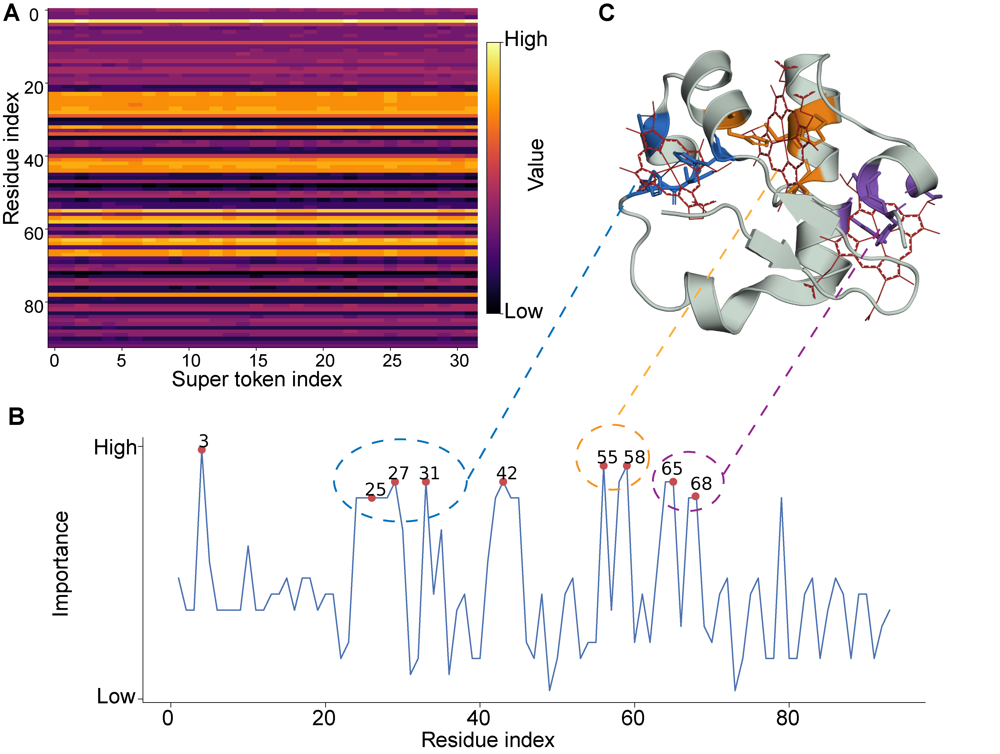
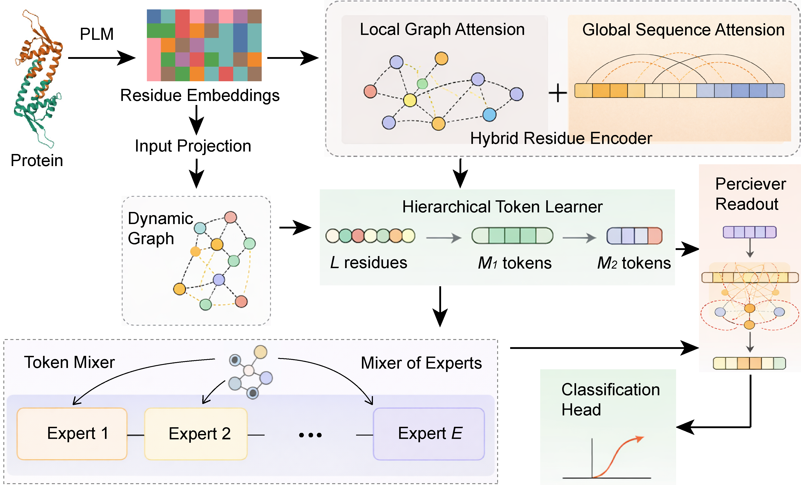

# GHOST-DP: Dynamic residue graph learning with hybrid self-distillation for structure-free protein druggability prediction.

<p align="center">
  
</p>


We propose GHOST-DP, a sequence-based neural framework for protein druggability prediction. Starting from residue-level ESM2 embeddings, GHOST-DP constructs a dynamic k-nearest-neighbour residue graph in embedding space, augmented with short-range sequential neighbours, to introduce a structure-inspired local inductive bias without requiring explicit structural input. A hybrid encoder then combines graph-based local propagation with efficient global sequence mixing, allowing the model to learn both local residue-level evidence and long-range protein-level context in a unified architecture. The resulting residue representations are hierarchically compressed into compact protein-level tokens and adaptively processed by Mixture-of-Experts token mixing before classification. To improve robustness under heterogeneous label definitions and external distribution shifts, the model is further optimized with exponential moving average self-distillation and multi-view consistency learning. The seminal innovations of the present work can encapsulate:
1) We introduce an embedding-space dynamic residue graph for structure-free protein druggability prediction. This graph provides a sequence-derived local topology prior without requiring explicit 3D coordinates, predicted structures or pocket annotations.
2) We develop a hybrid local-global neural architecture that integrates graph-based residue propagation, global sequence mixing and hierarchical token compression, enabling compact modelling of both local residue patterns and protein-level dependencies.
3) We establish a stability-oriented training framework based on exponential moving average self-distillation and multi-view consistency, improving robustness under limited supervision, heterogeneous negative definitions and external benchmark shifts.
 

The architecture of our framework is:
<p align="center">
  
</p>


## Table of Contents

* [Installation](#Installation)
* [Usage](#Usage)

## Installation

This code was implemented in Python using PyTorch. The model takes pre-computed protein language model embeddings stored as ".npz" files and trains a dynamic residue-graph neural network for protein druggability prediction.

To correctly use **GHOST-DP** via your local device, we recommend following environment:
~~~shell
Python >= 3.10
PyTorch >= 2.0
NumPy >= 1.23
CUDA-enabled GPU recommended
~~~

Minimal installation with conda:
~~~shell
conda create -n druggability python=3.10 -y
conda activate druggability
# Install PyTorch according to your CUDA version.
# Example for a CUDA-enabled Linux machine:
pip install torch torchvision torchaudio --index-url https://download.pytorch.org/whl/cu118
# Core numerical dependency
pip install numpy
~~~

For a CPU-only environment:
~~~shell
conda create -n druggability python=3.10 -y
conda activate druggability
pip install torch torchvision torchaudio
pip install numpy
~~~

Once success, you have the right environment to use GHOST-DP.


## Usage

### 1. Expected data layout
The script assumes that ESM2 embeddings have already been generated and saved as ".npz" files. It does not compute ESM2 embeddings internally. Expected data layout is:
```text
data/
├── Train_neg/
│   ├── prot_emb_000.npz
│   └── ...
├── Train_pos/
│   ├── prot_emb_000.npz
│   └── ...
├── Test_neg/
│   ├── prot_emb_000.npz
│   └── ...
└── Test_pos/
    ├── prot_emb_000.npz
    └── ...
```
Each ".npz" file should contain one or more arrays with keys like:
~~~
prot_000987__tok
~~~
Each array should have shape:
~~~
[L, 1280]
~~~
where L is the length of current protein and 1280 is the embedding dimension of EMS2.

### 2.try with demo data
You can try any protein data as you wish. If you want to have a quick experience of GHOST-DP, then directly use ours: [Zenodo](https://zenodo.org/records/19803648)

### 3. Hardware note
A CUDA GPU is recommended because the model builds dynamic kNN residue graphs and uses attention-based modules. The default configuration uses batch_size=1, MAX_LEN=1000, and knn_max_tokens=500, which makes it feasible on a single modern GPU, but the exact memory usage depends on sequence length and model size.

### 4. Code organization and How to use
For ease of use and quick experimentation, all model components, data loading utilities, training procedures, and evaluation functions are integrated into a single script: [`main.py`](main.py). The available command-line arguments and hyperparameters are defined in the argument parser at the end of the script. Please refer to the [script](main.py) for the full list of configurable options. For a quick trial, try this:
~~~shell
python main.py --base_dir ./data --out_dir ./results --device cuda
~~~


